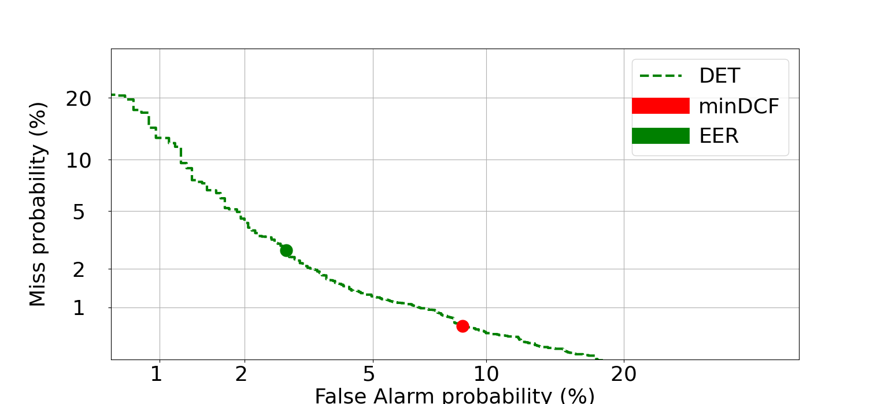
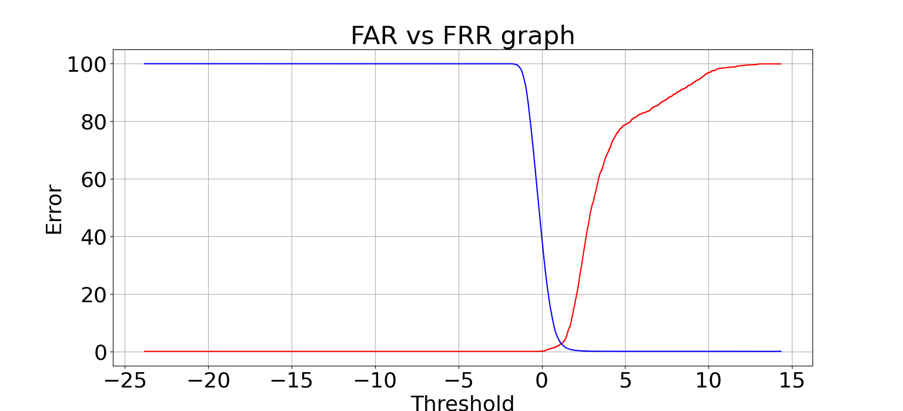
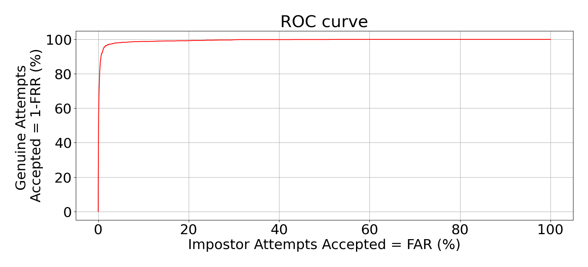

# DET - Detection Error Tradeoff 
Characteristic showing relation among probability of two 
errors: False Acceptance vs False Rejection, when threshold
of acceptance/rejection is changeable. Is suitable for binary 
classification or detection tasks. In this type of characteristic 
axis are no linear. More FAR and FRR error are similiar to gaussian
more characteristic is linear .

Those plots are sufficient to place well known EER (Equal Error Rate)
and minDCF (minimal Decision Cost Function) - error when we assume cost of 
error.

File *main.py* presents example of use scripts. In the second part
of file *main.py* include FRR vs FAR - cumulative distributions
of two types of errors well discribe ROC curve.

